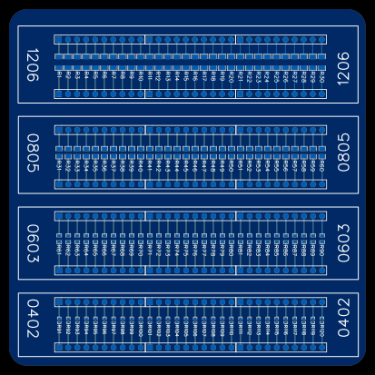
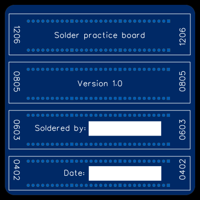

Soldering Practice Board
========================

A coinvent and easy way to practice soldering surface mount components. This board provides 30 of each of the following footprints:

* 0402 (1005 metric)
* 0603 (1608 metric)
* 0805 (2012 metric)
* 1206 (3216 metric)

Each resistor is spaced 0.1 inch apart and there is a through holes connected to each side of the surface mount footprints, so that you can easily test whether your soldering is good. E.g. if you solder resistors to the surface mount footprints then you can measure the resistance between the through holes to verify the resistor is soldered down connectly.

Licence
-------

Copyright © 2023 Phil Baldwin

This work is licensed under a Creative Commons Attribution-ShareAlike 4.0 International License.

You should have received a copy of the license along with this work. If not, see <http://creativecommons.org/licenses/by-sa/4.0/>.
